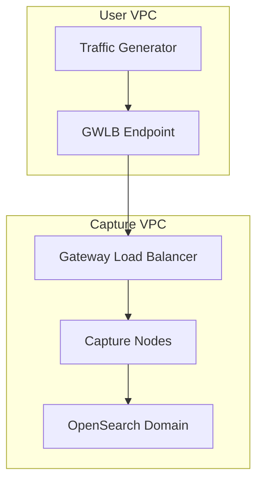

# README Writing Guide

This document contains line-item preferences for creating README files. When writing a README, apply these preferences consistently.

## Structure and Organization

### Fundamental Principle: Context Before Instructions

Always follow this information flow:
1. **Overview/Purpose** - What it is, why it exists
2. **Architecture/Workflow/Approach** - How it works conceptually
3. **Prerequisites** - What you need
4. **Setup/Usage** - How to run it
5. **Examples** - Concrete usage

Readers should understand *what* and *why* before learning *how*.

### Required Sections

Every README should include:
- **Title** (H1) - Project name
- **Overview/Purpose section** - 1-3 paragraphs explaining what the project does and what problem it solves
- **Prerequisites** - Required software, credentials, configuration
- **Setup/Running instructions** - How to actually use it

### Optional Sections

Include these sections only when they provide value:
- **Table of Contents** - Only for longer READMEs with 6+ major sections (see aws-aio example)
- **Architecture and Design** - For complex infrastructure or systems with multiple interacting components
- **Workflow/How it Works** - For applications with multi-step user interactions
- **Troubleshooting** - If there are known issues or common pitfalls
- **Testing** - If there are specific test datasets or testing procedures
- **Contribute/Maintainers/License** - For open-source projects expecting contributions

### Adaptive Organization

Structure adapts to the project's nature, not a rigid template:
- **Infrastructure projects** (aws-aio) - Emphasize architecture components and operational concerns
- **Web applications** (ocsf-playground) - Detail user workflow and UI interactions
- **Developer tools** (transformation-playground) - Focus on API usage and code examples
- **Libraries** - Emphasize installation and usage examples

### Section Naming Conventions

Use descriptive nouns for static/informational sections:
- ✅ "Architecture and Design"
- ✅ "Pre-requisites"
- ✅ "Account Limits, Scaling, and Other Concerns"
- ✅ "Known issues and caveats"
- ❌ NOT "What is it?"
- ❌ NOT "Getting Started"
- ❌ NOT "How to Install"

Use gerunds (verb+ing) for action-oriented sections:
- ✅ "Running the Code"
- ✅ "Setting Up Demo Traffic Generation"
- ✅ "Launching the app"
- ✅ "Generating the OCSF schemas"

Use "How to [verb]" sparingly, and only for procedural guides:
- ✅ "How to Run the AWS All-in-One CLI"
- ✅ "How to shell into the ECS containers"
- ✅ "How to handle changes to the backend API"

## Tone and Writing Style

### Voice

Use **third-person descriptive** for explanatory content:
- ✅ "The tool provides a Python CLI..."
- ✅ "This app is focused on solving..."
- ✅ "The system employs several AWS services..."
- ❌ NOT "We built this tool to..."
- ❌ NOT "I created this to help you..."

Use **imperative/instructional** for setup and usage:
- ✅ "Install the prerequisites"
- ✅ "Start the backend like so:"
- ✅ "Run the following commands..."

Avoid personal pronouns in main documentation:
- ❌ NOT "You should configure your credentials"
- ✅ INSTEAD "Configure AWS credentials in ~/.aws/credentials"
- ❌ NOT "You'll need to install..."
- ✅ INSTEAD "Prerequisites:"

### Formality and Technical Tone

Maintain objective, engineer-to-engineer communication:
- Technical but accessible
- Use proper terminology without over-explaining basics
- Assume reader has relevant domain knowledge
- No marketing language ("powerful", "easy", "amazing", "elegant")
- No unnecessary superlatives
- Present tense for describing functionality
- Past tense only for version history or known issues

### Clarity and Conciseness

Sentence structure:
- Keep sentences focused and direct
- Use bullets for lists of related items
- Use paragraphs for explanatory prose
- Break complex information into digestible chunks

When to use lists vs. paragraphs:
- **Lists** for prerequisites, steps, feature enumeration, options
- **Paragraphs** for conceptual explanations, architecture descriptions, workflow narratives

Provide enough context to understand and use effectively—no more, no less:
- Include version-specific requirements
- State known limitations prominently
- Document operational constraints (quotas, scale limits)
- Provide key workflow sequences
- Omit exhaustive API documentation (link to external docs instead)
- Omit every possible flag/option (provide common patterns)

### Terminology

Use inline code formatting to disambiguate technical terms from prose (see "Inline Code" section).

Avoid these patterns:
- Marketing speak or buzzwords
- Anthropomorphizing code ("the script is smart enough to...")
- Hedging language in instructions ("you might want to...", "you should probably...")

## Code Examples and Formatting

### Code Blocks

When to include:
- Installation commands
- Setup procedures
- API usage examples
- Configuration file contents
- Expected output for complex operations

Always specify language for syntax highlighting:
```bash
python3 -m venv venv
```

```json
{"key": "value"}
```

```python
def example():
    pass
```

Provide complete, working examples:
- Full commands that can be copy-pasted
- Real data structures, not placeholder/toy examples
- Multiple variants when relevant (e.g., ES 6.8 vs 7.10 examples)
- Actual output samples when helpful for verification

### Inline Code

Use inline code formatting (`backticks`) for:
- Command names: `npm install`, `manage_arkime.py`, `git status`
- Flags and options: `--cluster-name`, `-r`, `--help`
- File paths: `./manage_arkime.py`, `~/.aws/credentials`, `/var/log/secure`
- Directory names: `config-YourClusterName-111111111111-us-east-2`, `playground/`
- AWS service names: `VPC Traffic Mirroring`, `Gateway Load Balancer`, `OpenSearch`
- Technical identifiers: `vpc-123456789`, `JSESSIONID`, `us-west-2`
- Configuration values: `python3`, `Node 18`, `Claude 3.7 Sonnet`
- Environment variables: `AWS_REGION`
- Function/method names: `cluster-create`, `vpc-add`, `get-login-details`
- Package names: `boto3`, `pipenv`, `aws-cdk`

Do NOT use inline code for:
- General concepts: "traffic mirroring" (unless it's the specific AWS service name)
- Common technical terms: "virtual environment", "credentials", "container"
- Emphasis (use **bold** for emphasis if needed)

### Command Examples

Format shell commands without prompts:
```bash
aws iam create-service-linked-role --aws-service-name es.amazonaws.com
```

NOT:
```bash
$ aws iam create-service-linked-role --aws-service-name es.amazonaws.com
```

For multi-line commands, use line continuation when logical:
```bash
./manage_arkime.py cluster-create --name MyCluster --expected-traffic 0.01 --spi-days 30 --replicas 1
```

When showing command sequences, use separate code blocks:
```bash
python3 -m venv venv
source venv/bin/activate
pipenv sync --dev
```

Or chain with `&&` when commands must be sequential:
```bash
(cd playground && python3 manage.py runserver)
```

Show command output when it provides important information:
```bash
aws sts get-caller-identity
```

Include explanatory text before or after code blocks, not as comments within code (unless the comments are part of actual code).

## Installation and Usage Instructions

### Prerequisites

Structure prerequisites clearly:
- Start with a "Prerequisites" or "Pre-requisites" section
- List required software with version numbers
- Include installation/configuration requirements
- Link to external setup guides when helpful
- Explain *why* each prerequisite is needed (see aws-aio example)

```markdown
### Pre-requisites

#### Software and Configuration

* REQUIRED: Python 3.10+ (this is what powers the Django REST API backend)
* REQUIRED: NodeJS 20+/NPM 10+ (this is what powers the NextJS/React frontend)

Additionally, you'll need to provide access to AWS Bedrock...
```

### Installation

Provide step-by-step setup:
- Show actual commands in order
- Include virtual environment setup when applicable
- Note one-time setup steps separately from regular usage
- Explain any manual prerequisites (like IAM roles)

### Usage

Structure basic usage before advanced scenarios:
- Show minimal working example first
- Then show common variations
- Document optional parameters when they affect common use cases
- Use section headers to organize different usage patterns

## Visual Elements

### General Visual Principles

Visuals should communicate information that would be difficult or verbose in text alone. They serve the content, not marketing.

**Never include:**
- Badges (build status, version, downloads, etc.)
- Emoji
- Decorative images or hero images
- Logo graphics
- Marketing visuals
- Screenshots with annotations, arrows, or callouts overlaid

### Architecture Diagrams

**When to include:**
Complex infrastructure or systems where component relationships and data flow are essential to understanding. Examples:
- Multi-service cloud architectures (aws-aio)
- Distributed systems with multiple interacting components
- Cross-account or cross-network configurations

**Diagram standards:**
- Professional system architecture style (boxes, arrows, layers)
- Color-coded components with a legend explaining the color scheme
- Clear labels on all components
- Data flow indicators (arrows)
- Formal figure numbering and descriptive captions
- Reference diagrams in text: "**Figure 1:** Current high level design..."
- Place diagrams in the "Architecture and Design" section

**Example pattern from aws-aio:**
```markdown
**Figure 1:** Current high level design of the Arkime AWS All-in-One Project


**Figure 2:** Current detailed design of the Arkime AWS All-in-One Project w/ all features in use


```

### Application Screenshots

**When to include:**
UI-based applications where multi-step workflows benefit from visual demonstration. Examples:
- Web applications with complex user workflows (ocsf-playground)
- GUI tools where interface layout is relevant
- Tools with visual output that's easier to show than describe

**Screenshot standards:**
- Full application views (not cropped sections)
- Clean, un-marked screenshots showing actual UI
- No annotations, arrows, highlights, or callouts
- Embedded inline within workflow description
- Descriptive captions or alt text
- Follow sequential workflow order
- High enough resolution to be readable

**Example pattern from ocsf-playground:**
```markdown
### The OCSF Normalization Playground workflow

After launching the app, it will surface the web app at `http://127.0.0.1:3000`...


Next, you'll want to create the entity mappings...


```

### Organizing Visual Assets

Store visual assets in appropriate directories:
- Root directory: Acceptable for 1-2 architecture diagrams in smaller projects
- `resources/` or `docs/` subdirectory: For multiple screenshots or images
- Consistent naming: descriptive filenames like `cloud_arkime_design.png`, `ocsf_playground_heuristic_category.png`

### Creating Visuals When Writing READMEs

When Claude writes a README, visual elements should be handled differently based on type:

#### Architecture Diagrams: Generate Draft + Specification

For architecture diagrams, Claude should:
1. **Generate a draft diagram** using Mermaid or PlantUML (choose based on diagram type)
2. **Include a detailed specification** above the diagram explaining what it should show
3. **Make it obvious this is a draft** requiring human review

The draft diagram serves to:
- Stand out visually and prompt immediate human attention
- Provide a working starting point
- Communicate structure and relationships

The human can then:
- Keep the generated diagram as-is
- Refine it using the same tool
- Recreate it in Draw.io or another tool for a more polished look
- Remove it if it doesn't add sufficient value

**Mermaid vs. PlantUML:**
- **Mermaid**: Better for flowcharts, sequence diagrams, simpler system architectures, state machines, C4 diagrams
- **PlantUML**: Better for detailed UML diagrams, complex component diagrams, deployment diagrams with many relationships

For aws-aio-style system architecture diagrams (boxes, layers, data flow), either can work but Mermaid's C4 or flowchart syntax often produces cleaner results.

**Diagram style guidance:**
The "vibe" should be practical, restrained, and precise:
- Clear component boundaries and labels
- Logical grouping (by layer, account, network, etc.)
- Data flow arrows that clarify relationships
- Minimal decoration - focus on information
- Color coding only when it clarifies understanding (with legend)

**Example format:**
```markdown
**Figure 1:** High-level system architecture showing traffic flow from User VPC through Gateway Load Balancer to Capture VPC

<!--
DIAGRAM SPECIFICATION:
- Show User VPC (grey background) containing: Subnets with Traffic Generators and GWLB Endpoints
- Show Capture VPC (green background) containing: Gateway LB, Capture Nodes, OpenSearch Domain
- Show Viewer VPC (blue background) containing: Viewer Nodes
- Arrows indicating traffic flow: User VPC → GWLB → Capture Nodes → OpenSearch
- Legend explaining color coding: grey=pre-existing, green=capture components, blue=viewer components
- Human should review: Does this accurately represent the architecture? Does it need more/less detail?
-->



<!--
If keeping this diagram, save as: ./architecture_diagram.png
If recreating in Draw.io, use the specification above to guide design.
-->
```

#### Application Screenshots: Specify Only

For application screenshots, Claude should:
1. **Include a placeholder specification** where the screenshot should go
2. **Describe exactly what the screenshot should capture**
3. **Explain why this screenshot adds value**

The human must capture actual screenshots since this requires running the application.

**Example format:**
```markdown
### The OCSF Normalization Playground workflow

After launching the app, it will surface the web app at `http://127.0.0.1:3000`...

<!--
SCREENSHOT NEEDED: resources/ocsf_playground_heuristic_category.png
Capture: Main application view showing the regex pattern testing and OCSF category selection interface
State: After importing sample logs, with one log entry selected, showing the "Get GenAI Recommendation" and "Set User Guidance" buttons
Why: Demonstrates the first critical step in the workflow - targeting and categorization
Resolution: Full browser window at 1920x1080 or higher
-->


Next, you'll want to create the entity mappings...
```

#### Pragmatic Completeness for Visuals

Apply the same pragmatic completeness principle to visuals as to all documentation:
- Only create diagrams for items of **highest value** to express visually
- If text can explain it clearly in a paragraph, skip the diagram
- Diagrams have most impact when they reveal **relationships, flow, or structure** that's difficult to articulate in prose
- Complex infrastructure → diagram is high value
- Simple linear workflow → text description may suffice
- Multi-component system → diagram is high value
- Single service architecture → text may suffice

When in doubt, generate the draft diagram with specification and let the human decide whether to keep it.

## Special Considerations

### Project Type Differences

**Infrastructure/CLI tools** (aws-aio):
- Emphasize architecture and component relationships
- Document operational constraints (scaling, quotas, limits)
- Provide detailed prerequisite setup (credentials, roles, permissions)
- Include troubleshooting section for common deployment issues
- Show cross-account or multi-environment setup when applicable

**Web applications** (ocsf-playground):
- Lead with the problem being solved
- Document the user workflow step-by-step
- Include screenshots of key workflow stages
- Separate backend and frontend setup instructions
- Provide example input data for testing

**Developer tools/libraries** (transformation-playground):
- Focus on API usage and code examples
- Show multiple example inputs/outputs
- Document how to handle API/spec changes
- Include curl examples for REST APIs
- Balance minimal vs. comprehensive examples

### Audience Considerations

Assume reader has relevant domain knowledge:
- Don't over-explain basic concepts in the domain
- Use proper terminology without excessive hand-holding
- Link to external documentation for foundational knowledge
- Provide enough context for someone with domain expertise to get started

Balance accessibility with completeness:
- Core setup should be straightforward for target audience
- Advanced use cases can reference external docs or be more terse
- Known issues and caveats should be prominently documented
- Edge cases can be brief or link to GitHub issues

## Examples

### Good Examples

These READMEs exemplify the preferences in this guide:

1. **aws-aio** (https://github.com/arkime/aws-aio)
   - Complex infrastructure project with formal architecture diagrams
   - Table of contents for lengthy documentation
   - Detailed prerequisites with explanations
   - Multiple workflow scenarios (same-account, cross-account)
   - Prominent documentation of scaling constraints and limitations

2. **ocsf-playground** (https://github.com/chelma/ocsf-playground)
   - Problem-statement opening
   - Step-by-step workflow with supporting screenshots
   - Known issues and caveats prominently placed
   - Clean separation of backend and frontend setup
   - Example test data provided inline

3. **transformation-playground** (https://github.com/chelma/transformation-playground)
   - Concise overview for work-in-progress
   - API-first documentation with curl examples
   - Multiple JSON input examples (ES 6.8, ES 7.10)
   - Clear backend/frontend separation

### Anti-Patterns to Avoid

**Structure anti-patterns:**
- Starting with installation before explaining what the project does
- Using "Getting Started" as a catch-all section
- Burying prerequisites deep in documentation
- No table of contents for lengthy READMEs

**Tone anti-patterns:**
- "This amazing tool makes it easy to..."
- "You'll love how simple it is to..."
- "We built this powerful solution..."
- "Simply install and you're good to go!"

**Code example anti-patterns:**
- Including shell prompts: `$ command` or `> command`
- Placeholder values without real examples: `YOUR_API_KEY_HERE`
- Incomplete commands that can't be copy-pasted
- No syntax highlighting on code blocks

**Visual anti-patterns:**
- Badge collection at the top of README
- Screenshots with red arrows and annotations pointing at UI elements
- Decorative hero images or project logos
- Emoji in headings or text

---

## Iteration Notes

This guide was initially created by analyzing three sample READMEs:
- https://github.com/arkime/aws-aio (complex infrastructure)
- https://github.com/chelma/ocsf-playground (web application workflow)
- https://github.com/chelma/transformation-playground (developer tool/API)

This guide will continue to be refined based on:
- Review of additional README files
- Feedback from using this guide in practice
- Evolving preferences and project needs
- New project types or documentation patterns
